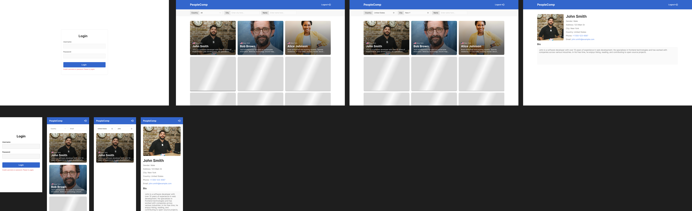

# Frontend Developer Task

## Overview

Implement a responsive contact management application based on the provided design. The application should support both desktop and mobile layouts, user authentication, and dynamic data management with filtering and pagination capabilities.

## Design Files

- **Figma Design**: `./assets/design.fig`
- **Preview Image**: `./assets/preview.png`

## API Documentation

**Base URL**: `https://metasite-fe-task-api.azurewebsites.net/api/v1`  
**Swagger Documentation**: [https://metasite-fe-task-api.azurewebsites.net/api/docs/v1](https://metasite-fe-task-api.azurewebsites.net/api/docs/v1)

### Available Endpoints

#### Authentication

- `POST /login` - User authentication
- `POST /refresh` - Refresh authentication token

#### Data Management

- `GET /list` - Get public contact list (no auth required)
- `GET /private-list` - Get private contact list (auth required)
- `GET /list-item?id={id}` - Get specific contact details

### Authentication Flow

- Login with credentials to receive access and refresh tokens
- Use access token in Authorization header: `Bearer {token}`
- Implement token refresh logic for expired tokens

**Auth Credentials:**

- Username: `metasite`
- Password: `frontend-task`

## Technical Requirements

### Core Features

- **Authentication System**: Login functionality with token management
- **Contact List**: Infinite scroll/lazy loading implementation
- **Filtering**: Search by name, city, and country
- **Routing**: Client-side navigation between views
- **Responsive Design**: Support for both desktop and mobile layouts
- **Contact Details**: View individual contact information

### Technology Stack

- **Preferred**: React + TypeScript
- **Browser Support**: Latest Chrome only
- **Version Control**: GitHub
- **Deployment**: GitHub Pages (optional)

## Evaluation Criteria

### Primary Focus Areas

- **Scalability & Maintainability** - Consistent spacing system and design tokens, theme variables, component reusability
- **Clean Code & Architecture** - Proper modularization, React/TypeScript best practices
- **Configuration & Tooling** - ESLint and Prettier setup with custom rules, TypeScript configuration
- **Data Management** - Infinite scroll/lazy loading implementation, efficient state management
- **Filtering & Search** - Multiple filter criteria support, filter state management
- **Routing** - URL state management
- **Authentication Logic** - Login/logout functionality, access token handling, refresh token logic (bonus)

### Additional Points

- **Accessibility** - Semantic HTML structure, ARIA labels and roles, keyboard navigation support
- **SEO** - Meta tags optimization, structured data
- **Testing**

## Submission Guidelines

### Requirements

1. **Source Code**: Public GitHub repository
2. **Deployment**: Live demo on GitHub Pages or similar platform (optional)
3. **Documentation**: Clear setup and run instructions

### Submission Process

Send your submission to **jobs@metasite.net** including:

- GitHub repository link
- Live demo URL (optional)
- Brief description of your implementation approach
- Any additional features or optimizations implemented

## Getting Started

1. Download the Figma design file from `./assets/design.fig`
2. Open the design file in Figma to review the layouts and specifications
3. Create a new GitHub repository for your implementation
4. Set up your development environment with React + TypeScript
5. Implement the application following the requirements using our API and design
6. Deploy to GitHub Pages
7. Submit your solution

---

**Note**: While this is a focused task, approach it as if building a foundation for a larger application. Demonstrate your ability to create maintainable, scalable code that could grow into a comprehensive contact management system.
